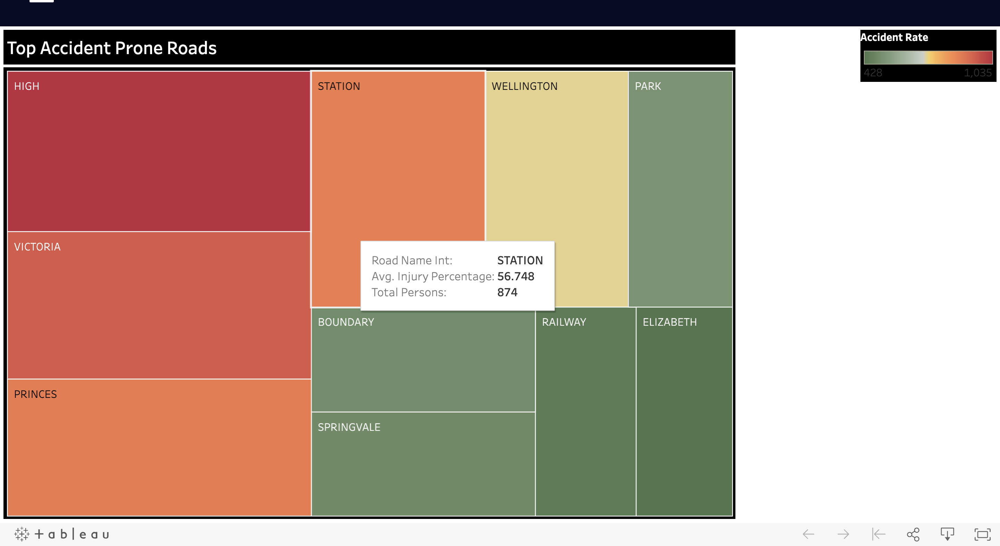

# Assignment - 2
Accident Prone Roads

Visualisation Link: https://dev1808.d4sqym1517zi0.amplifyapp.com (Incident Map takes 30-40 seconds time to load data layers (collision and Traffic Volume) because of the huge size).

This Website is based off a subset of accident data specifically related to Road accidents and collisions occurred in Victoria, Australia from time period of 2015 to 2019.

There are 4 visualisations has been created in the dashboard with each specifying different data and providing multiple insights out of it.

1.	Incident Map

It Provides information about the Road accidents and collisions happened in Victoria, Australia from 2016-2019 using geo visualisation. It displays multiple accidents happened in Victoria with the level of casualty occurred. We can check the accidents happened at different areas in multiple timelines (By Hour) using the slider option and also we filter the accidents based on the option of whether they happened on Weekdays or Weekends.

We can also toggle the layers of collisions and Traffic Volume where the layer of collisions displays the accidents points with multiple additional information about the accident and Traffic Volume displays the amount of average traffic occurs in different roads on Victoria and gradient  colours displayed ranges from green to red where green means less traffic and red means the more traffic on the roads on average.

2.	Accidents Weekly

This Accidents Weekly graph provide  analysis about the rate of accidents in the different week days and weekends which provides evidence that more than average accidents happens in the Thursdays and Fridays especially at the timings of 4:30 PM to 6:30 PM because of rush in the evenings and graph also provides the information about the number of Young drivers are most in the weekends .This information is provided so that additional preventative measures can be implemented in addition to any other useful conclusions that can be drawn.

3.	Accidents Timeline

This Accidents Timeline graph provide analysis about the rate of accidents occurred in different months over the years of 2016 – 2019 to mainly understand the trend and seasonality in the no. of accidents over the years. We have also shown a predictions of no. of accidents over first half of 2020 (Jan-Jun) and in order to compute this predictions we have created a timeseries model using fbprophet package.

4.	Dangerous Roads

This Dangerous roads shows a Tree Map which provides the evidence about most dangerous accident prone roads in Victoria which help the proper authorities to take appropriate measures like for example adding speedbumps ,Traffic signs etc. This visualisation was created using Tableau and been published to Tableau Public and using Tableau JavaScript API it was integrated with webpage.

Code Implementation:

The Website has been created using ReactJs and the Incident Map has been implemented using the Mapboxgl packages, Accidents Weekly and Accidents Timeline graphs has been implemented  using ChartJs. Finally we have used Tableau JavaScript API Integration to implement the Dangerous roads Tree Map by publishing the visualisation to Tableau Public.

NOTE:
All data taken from discover.data.vic.gov.au.

